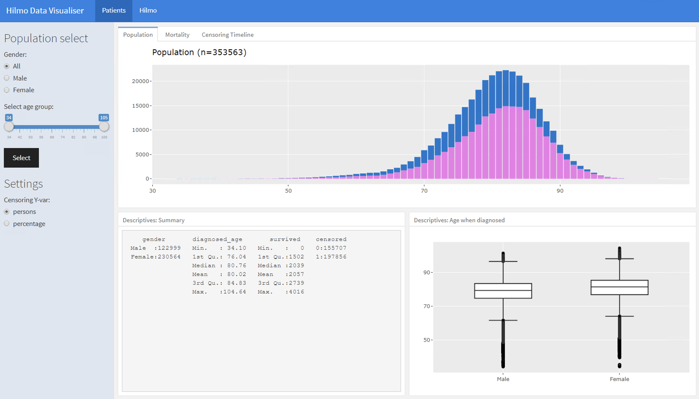
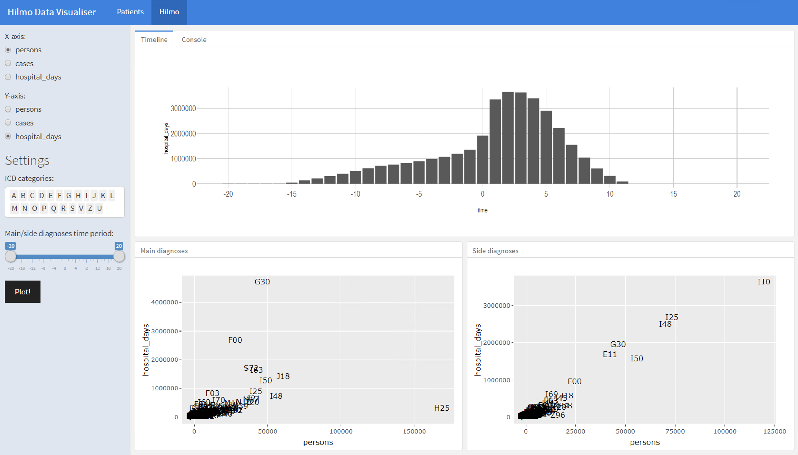

## README

This Shiny-app visualizes common hospital patient datasets (for example [Hilmo](https://thl.fi/fi/tilastot-ja-data/ohjeet-tietojen-toimittamiseen/hoitoilmoitusjarjestelma-hilmo) datasets). 

It is made for researchers to visualize patients doctoral visits timeline data. If you are interested what has happened to research population before and after certain date (for example date when got diagnosed to Alzheimer), you can visualize it with this application. Required input datasets are commented down below.

Information what you get from this application:

**Population**

- age/gender distribution, mortality, censoring timeline
- function for subsetting population

**Diagnoses timeline**

- overall key characteristics of population hospital visits
- main/side diagnoses plot during the timeline years


## Screenshots




## How to use this program?

1) First you need to prepare your datasets if not already. Use R scripts `create_data.R` for that. Go thru the script finding `!PREPARE:`-section (use find function) and edit the script file. Set input data folder path and dataset names. Make sure that you also write the variable names. Script will wrangle a new dataset for you to new location.

2) Set path for this new datasets image file in `global.R` script and you're ready to go. 

3) Run the Shiny-app by command:

```
source("run.R")
```

## Input dataset definitions

You can use your own dataset, but you need to reshape them for equivalent as described. Script `create_data.R` does this for you.


### Population data

Needed variables:

```
id              # Id number
birthday_date   # Date of birth
diagnosed_date  # Date when person got diagnosed
gender_factor   # Gender in factor var
died_date       # Date of person died
censoring_date  # Date when follow up study ended
area_SHP_code   # Hospital area Code
```

### Hospital Events dataset

Needed variables

```
id              # patient id
main_diagnose   # ICD-10 diagnose (can be multiple)
side_diagnose   # ICD-10 diagnose(can be multiple)
date_entered    # Date variable when patient entered to hospital 
date_left       # Date variable when patient left from hospital
```


## Acknowledgements

We are grateful for all comments from clinical advisors from KUH and UEF. Also we are grateful for funders and [Neurocenter Finland](https://neurocenterfinland.fi/) which made this project possible to develop. 

<p align="center">
  
  
  
  
</p>


About
===================

Found a bug? If you know github, you can open an [issue](https://github.com/janikmiet/hilmo-visualizer/issues).
</br>
</br>
**Source code:** <https://github.com/janikmiet/hilmo-visualizer>
</br>
**Licence:** [CC BY](https://creativecommons.org/licenses/by/4.0/). This license allows reusers to distribute, remix, adapt, and build upon the material in any medium or format, so long as attribution is given to the creator. The license allows for commercial use.
</br>
Copyright (c) 2020 Jani Miettinen </br>
</br>
